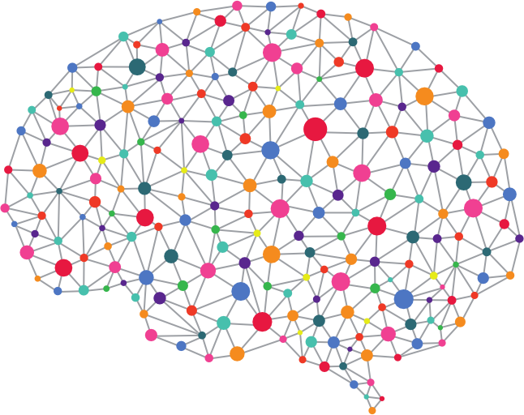

<!-- Header -->

    
    <h1>Practical Deep Learning</h1>
    <h5>
        <em>
            "The only Deep Learning course you'll ever need"
        </em>
    </h5>

<!-- end Header -->

<!-- shields -->

    
    

<!-- end shields -->

### Table of Contents
* [Quick Setup](#quick-setup)
* [License](#License)

### Chapters
* [Optical Character Recognition (OCR) using Neural Networks]()
    * [Problem Statement *at hand*]()

#### Quick Setup

#### License

This repository has been released under the <a href="http://creativecommons.org/licenses/by-nc/4.0">Creative Commons Attribution-NonCommercial 4.0 International License</a>.

